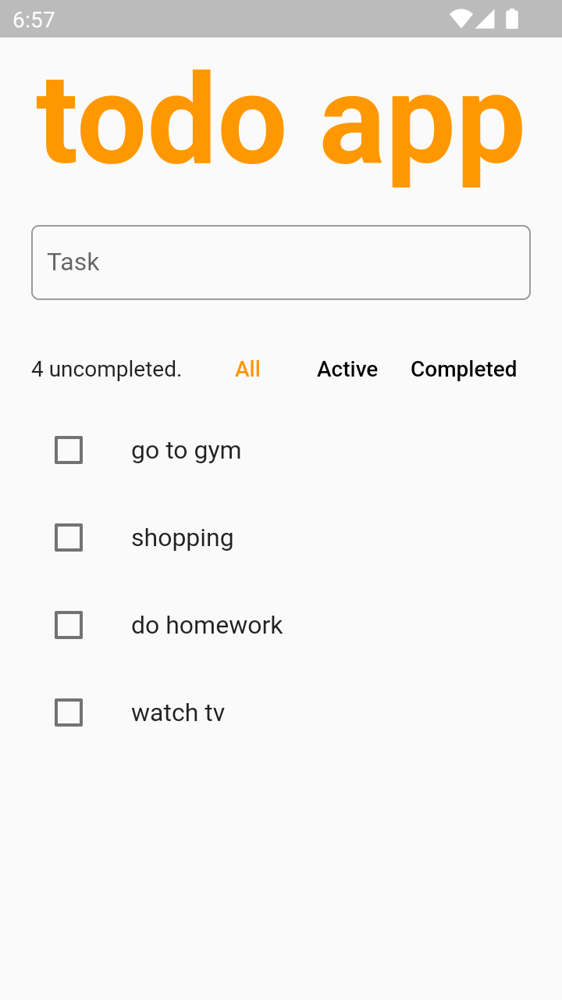
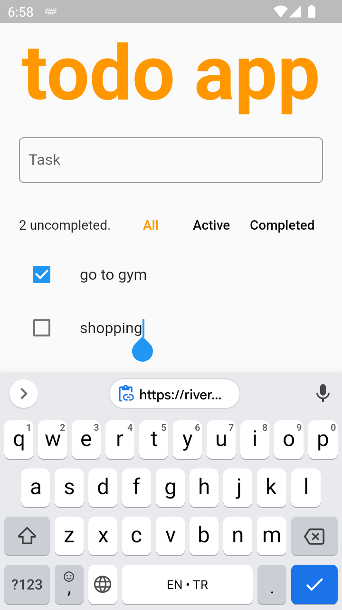
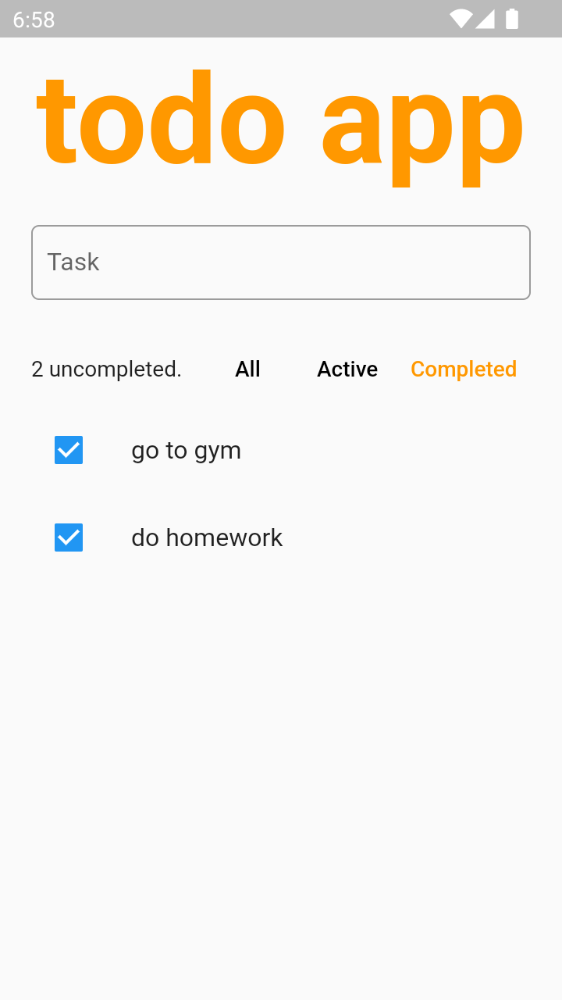

# Todo App Riverpod

This project is the sixth of my new simple Flutter projects.

## Features

- Riverpod
- Filtered List (All, active and completed tasks)

## Screenshots

|             Screenshot             |             Screenshot             |             Screenshot             |
| :--------------------------------: | :--------------------------------: | :--------------------------------: |
|  |  |  |

### Installing

- [RELEASES](https://github.com/cusufcan/todo_app_riverpod/releases/tag/flutter)

### Local Installing

- Just clone the repo.

## Built With

- [Flutter](https://flutter.dev/) - Flutter
- [Riverpod](https://riverpod.dev/) - Riverpod

## Authors

- [**Yusuf Can Mercan**](https://github.com/cusufcan)
